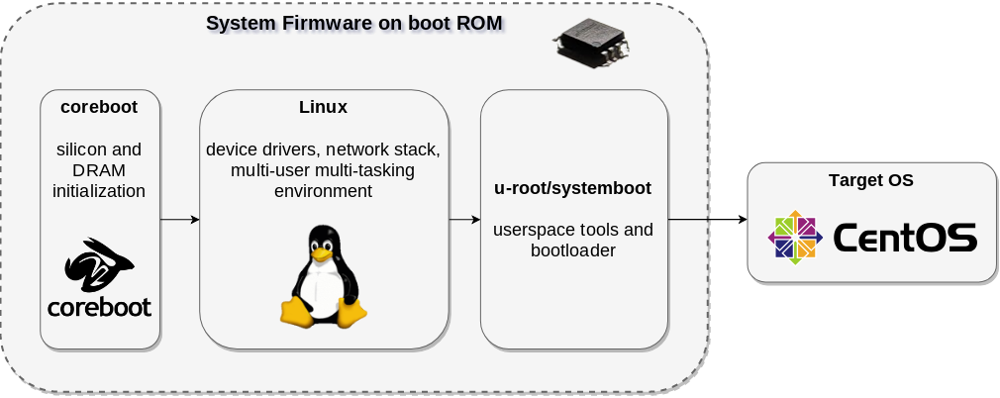

# systemboot

[](https://travis-ci.org/systemboot/systemboot)
[](https://codecov.io/gh/systemboot/systemboot)
[](https://goreportcard.com/report/github.com/systemboot/systemboot)


SystemBoot is a distribution for LinuxBoot to create a system firmware + bootloader. It is based on [u-root](https://github.com/u-root/u-root). The provided programs are:

* `netboot`: a network boot client that uses DHCP and HTTP to get a boot program based on Linux, and uses kexec to run it
* `localboot`: a tool that finds bootable kernel configurations on the local disks and boots them
* `uinit`: a wrapper around `netboot` and `localboot` that just mimicks a BIOS/UEFI BDS behaviour, by looping between network booting and local booting. The name `uinit` is necessary to be picked up as boot program by u-root.

This work is similar to the `pxeboot` and `boot` commands that are already part of u-root, but approach and implementation are slightly different. Thanks to Chris Koch and Jean-Marie Verdun for pioneering in this area.

This project started as a personal experiment under github.com/insomniacslk/systemboot but it is now an effort of a broader community and graduated to a real project for system firmwares.

The next sections go into further details.

## netboot

The `netboot` client has the duty of configuring the network, downloading a boot program, and kexec'ing it.
Optionally, the network configuration can be obtained via SLAAC and the boot program URL can be overridden to use a known endpoint.

In its DHCP-mode operation, `netboot` does the following:
* bring up the selected network interface (`eth0` by default)
* make a DHCPv6 transaction asking for network configuration, DNS, and a boot file URL
* extract network and DNS configuration from the DHCP reply and configure the interface
* extract the boot file URL from the DHCP reply and download it. The only supported scheme at the moment is HTTP. No TFTP, sorry, it's 2018 (but I accept pull requests)
* kexec the downloaded boot program

There is an additional mode that uses SLAAC and a known endpoint, that can be enabled with `-skip-dhcp`, `-netboot-url`, and a working SLAAC configuration.

## localboot

The `localboot` program looks for bootable kernels on attached storage and tries to boot them in order, until one succeeds.
In the future it will support a configurable boot order, but for that I need [Google VPD](https://chromium.googlesource.com/chromiumos/platform/vpd/) support, which will come soon.

In the current mode, `localboot` does the following:
* look for all the locally attached block devices
* try to mount them with all the available file systems
* look for a GRUB configuration on each mounted partition
* look for valid kernel configurations in each GRUB config
* try to boot (via kexec) each valid kernel/ramfs combination found above

In the future I will also support VPD, which will be used as a substitute for EFI variables, in this specific case to hold the boot order of the various boot entries.

## uinit

The `uinit` program just wraps `netboot` and `localboot` in a forever-loop logic, just like your BIOS/UEFI would do. At the moment it just loops between netboot and localboot in this order, but I plan to make this more flexible and configurable.

## How to build systemboot

* Install a recent version of Go, we recommend 1.10 or later
* make sure that your PATH points appropriately to wherever Go stores the
  go-get'ed executables
* Then build it with the `u-root` ramfs builder using the following commands:

```
go get -u github.com/u-root/u-root
go get -u github.com/systemboot/systemboot/{uinit,localboot,netboot}
u-root -build=bb core github.com/systemboot/systemboot/{uinit,localboot,netboot}
```

The initramfs will be located in `/tmp/initramfs_${platform}_${arch}.cpio`.

More detailed information about the build process for a full LinuxBoot firmware image
using u-root/systemboot and coreboot can be found in the [LinuxBoot book](https://github.com/linuxboot/book)
chapter 11, [LinuxBoot using coreboot, u-root and systemboot](https://github.com/linuxboot/book/blob/master/11.coreboot.u-root.systemboot/README.md).

## Example: LinuxBoot with coreboot

One of the ways to create a LinuxBoot system firmware is by using
[coreboot](https://coreboot.org) do the basic silicon and DRAM initialization,
and then run Linux as payload, with u-root and systemboot as initramfs. See the
following diagram:


(images from coreboot.org and wikipedia.org, diagram generated with draw.io)

## TODO

* Instructions to build a suitable kernel and run it with Qemu
* verified and measured boot
* a proper GRUB config parser
* backwards compatibility with BIOS-style partitions
